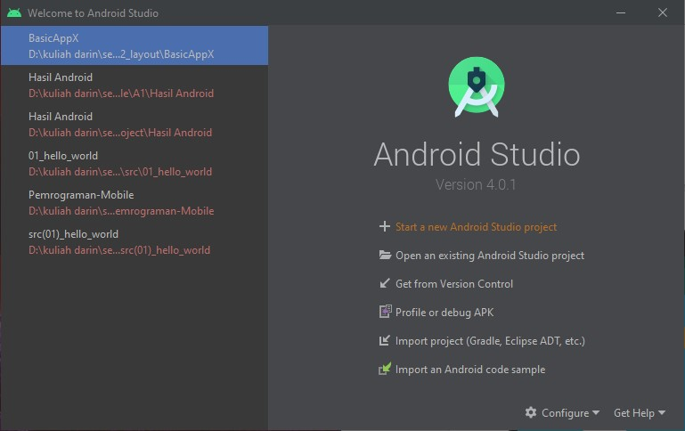
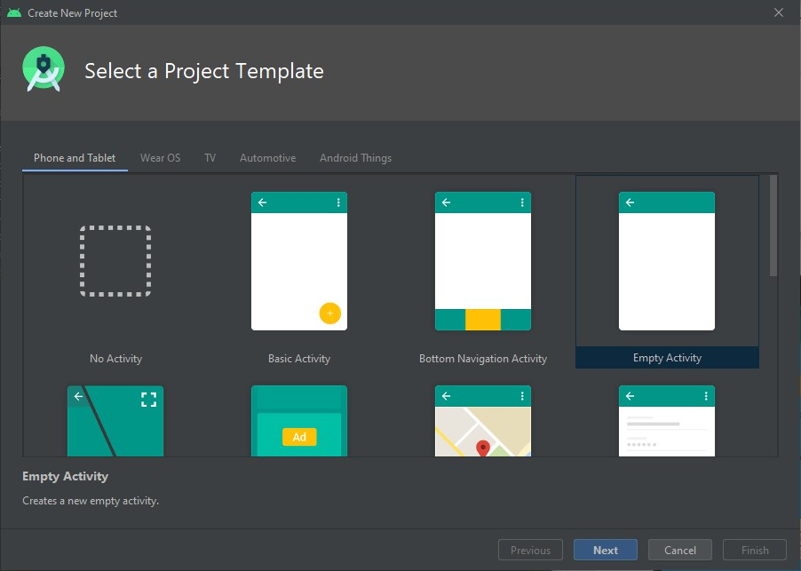
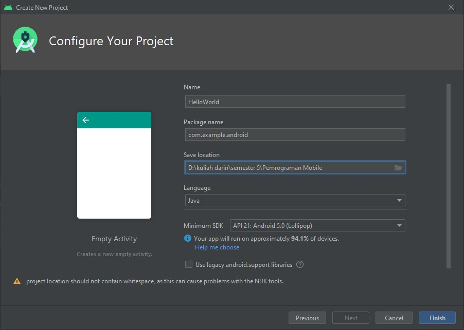
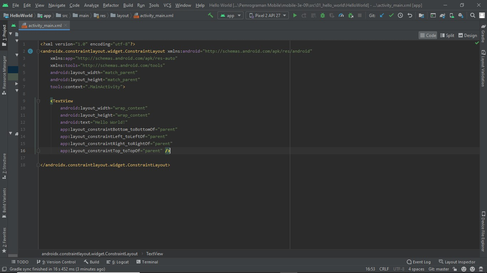
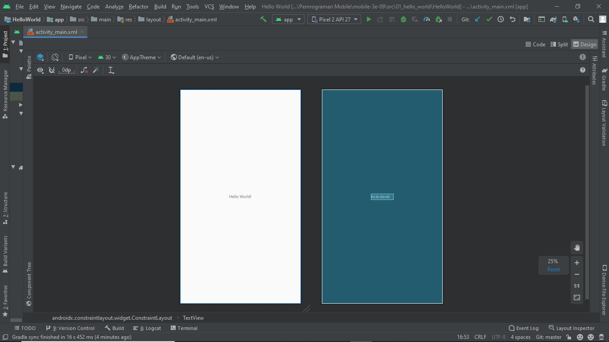
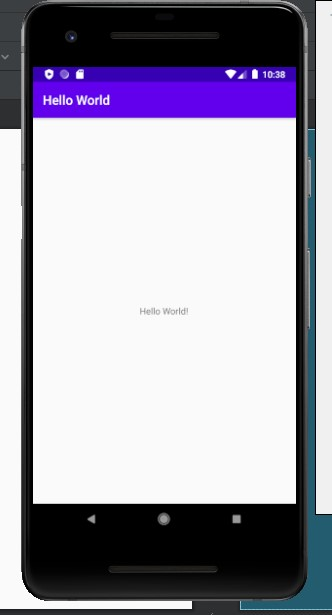

# 01 - Hello World

## Tujuan Pembelajaran

1. Mahasiswa mampu menginstall Android Studio, Android SDK, dan konfigurasi Kotlin
2. Mahasiswa Mampu menginstall Emulator
3. Mahasiswa Mampu Menghubungkan Perangkat Mobile Ke Komputer / Laptop
4. Mahasiswa mampu melakukan instalasi Git dan mengkonfigurasikannya di Android Studio

## Hasil Praktikum

Langkah 1 : Buka Studio Android dan pilih 'Start a new Android Studio project'.

Langkah 2 : Pilih 'Empty Activity' pada 'Phone and Tablet' dan klik Next.

Langkah 3 : Pada 'Configure Your Project' isilah Name, Package name, Save location, Language, dan Minimum SDK sesuai dengan project yang akan dibuat seperti dibawah ini. Kemudian klik finish

Langkah 4 : Akan muncul activity_main.xml (app/res/layout/activity_main.xml).

Tampilan Code pada activity_main.xml

Tampilan Design pada activity_main.xml

Hasil Ketika di Run

