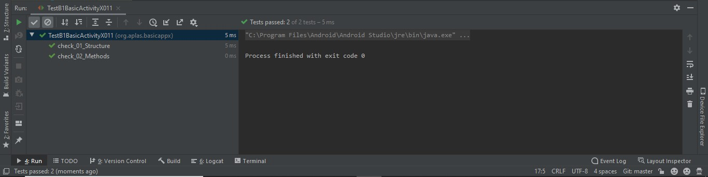
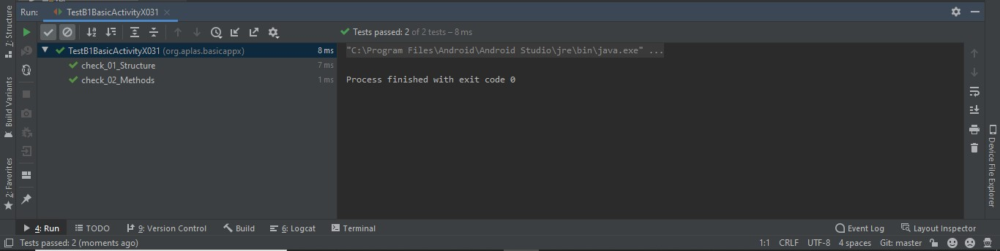
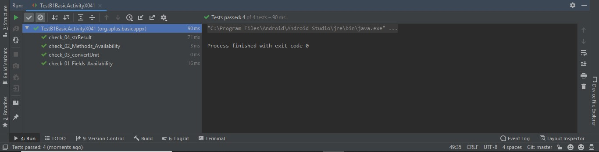
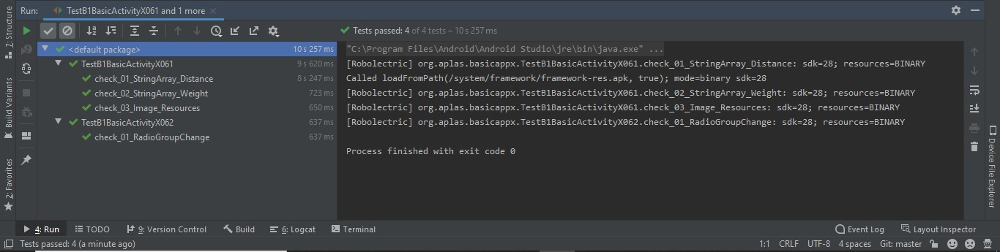
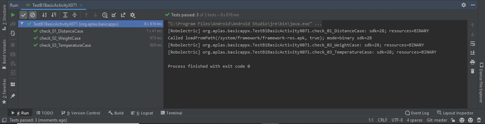
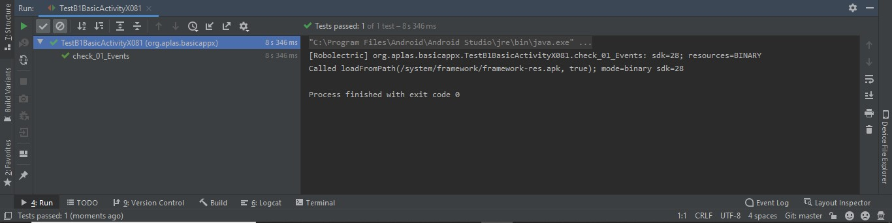
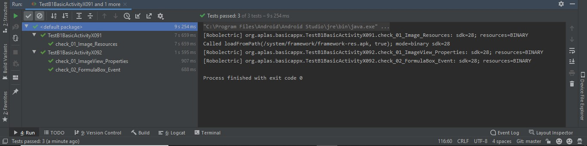
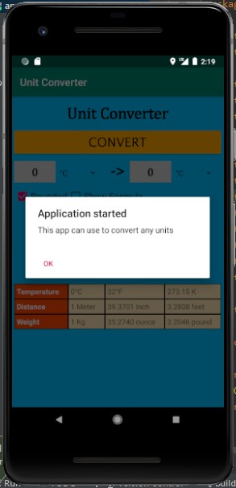
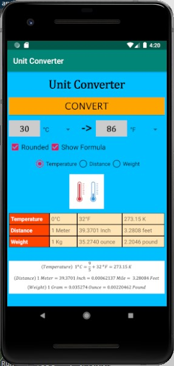
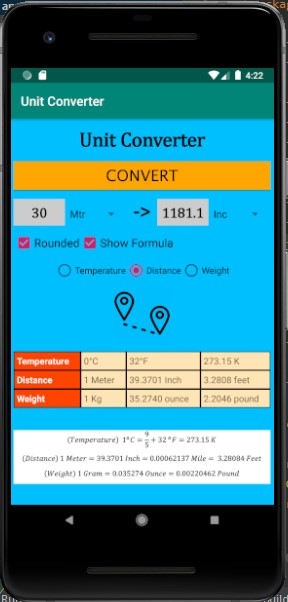

# 03 - Activity

## Tujuan Pembelajaran

1. Mahasiswa memahami konsep layout pada android.
2. Mahasiswa memahami konsep View Group dan Hierarchy pada layout.
3. Mahasiswa mampu membuat layout sederhana.
4. Mahasiswa menguasai layout editor dan kegunaannya pada android studio

## Hasil Praktikum

**Hasil Testing**

Hasil Task Guide (B1X.01)

Hasil Task Guide (B1X.02)

Hasil Task Guide (B1X.03)

Hasil Task Guide (B1X.04)

Hasil Task Guide (B1X.05)

Hasil Task Guide (B1X.06)

Hasil Task Guide (B1X.07)

Hasil Task Guide (B1X.08)

Hasil Task Guide (B1X.09)

**Tampilan Aplikasi Ketika di Run**

| Keterangan | Gambar |
|--|--|
| Tampilan Awal                  |  |
| Tampilan Convert Temperature |  |
| Tampilan Convert Distance  |  |
| Tampilan Convert Weight  |  |
