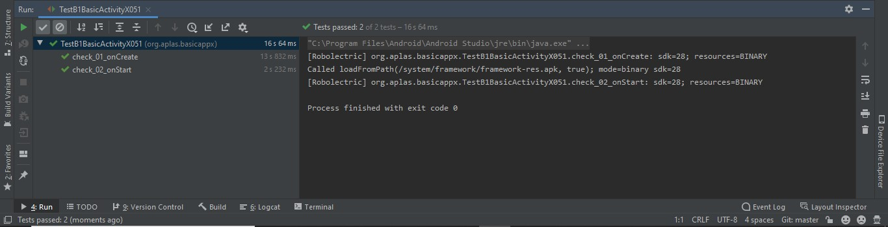
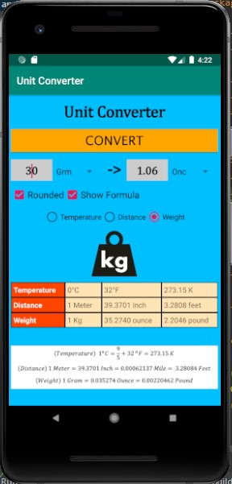

# 03 - Activity

## Tujuan Pembelajaran

1. Mahasiswa memahami konsep layout pada android.
2. Mahasiswa memahami konsep View Group dan Hierarchy pada layout.
3. Mahasiswa mampu membuat layout sederhana.
4. Mahasiswa menguasai layout editor dan kegunaannya pada android studio

## Hasil Praktikum

Hasil Task Guide (B1X.01)

Hasil Task Guide (B1X.02)

Hasil Task Guide (B1X.03)

Hasil Task Guide (B1X.04)

Hasil Task Guide (B1X.05)

Hasil Task Guide (B1X.06)

Hasil Task Guide (B1X.07)

Hasil Task Guide (B1X.08)

Hasil Task Guide (B1X.09)

Hasil Ketika di Run

Hasil Convert Temperature

Hasil Convert Distance

Hasil Convert Weight

