# 04 - colorGameX

## Tujuan Pembelajaran

1. Mahasiswa mampu memahami konsep penggunaan View Model pada aplikasi Android.
2. Mahasiswa mampu menerapkan konsep ViewModel pada aplikasi Android.

## Hasil Praktikum

Hasil Testing:

Hasil Task Guide (B2X.01)
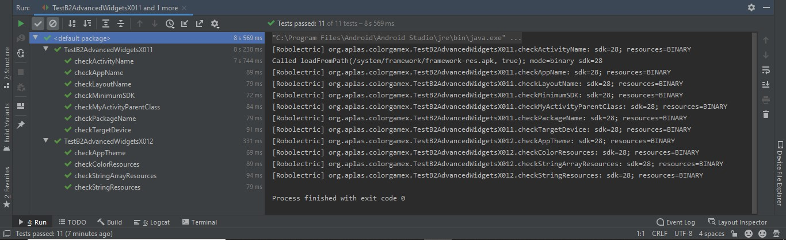

Hasil Task Guide (B2X.02)
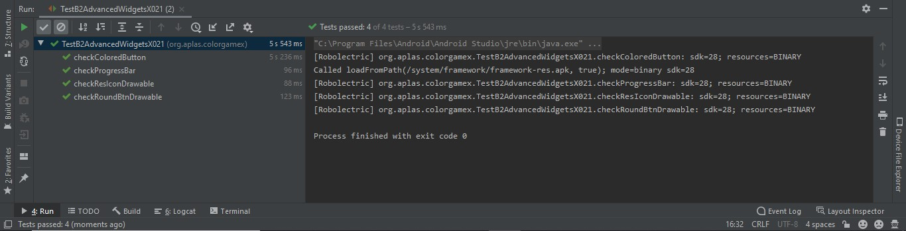

Hasil Task Guide (B2X.03)
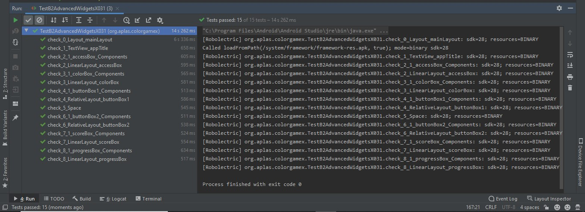

Hasil Task Guide (B2X.04)
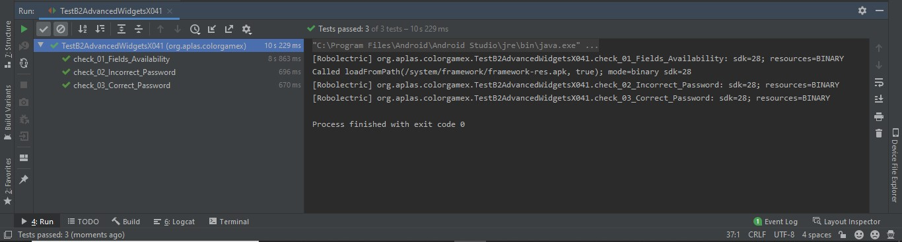

Hasil Task Guide (B2X.05)
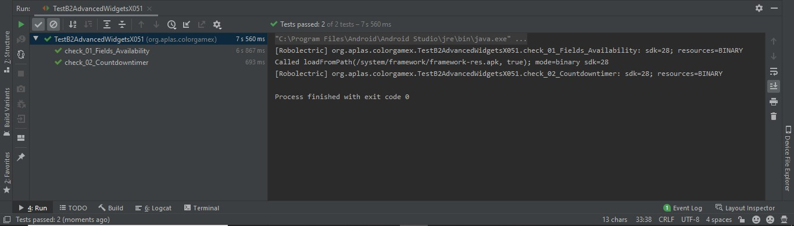

Hasil Task Guide (B2X.06)
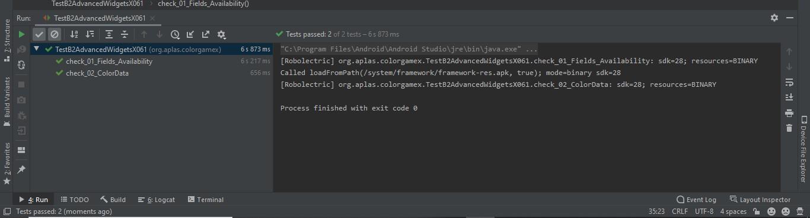

Hasil Task Guide (B2X.07)
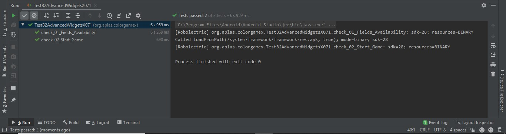

Hasil Task Guide (B2X.08)
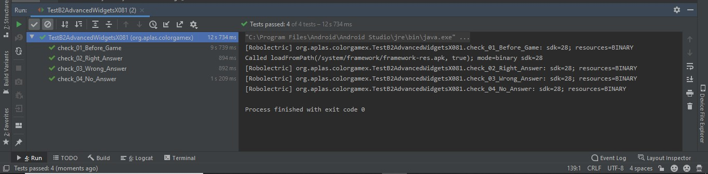

Tampilan Aplikasi Ketika di Run

Tampilan Awal

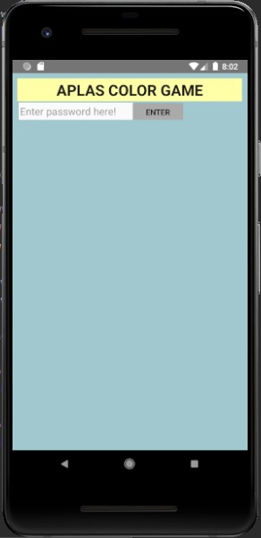

Tampilan Sebelum Game di Mulai

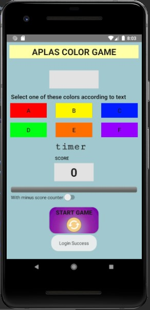

Tampilan Ketika Game di Mulai

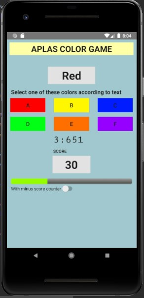

Tampilan Setelah Game selesai

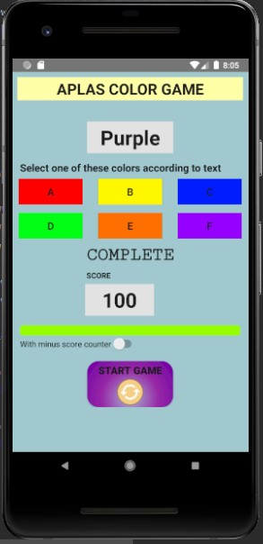