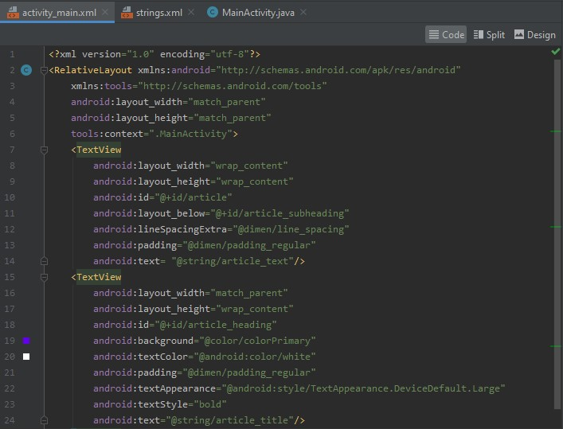
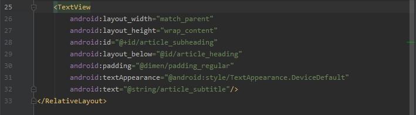
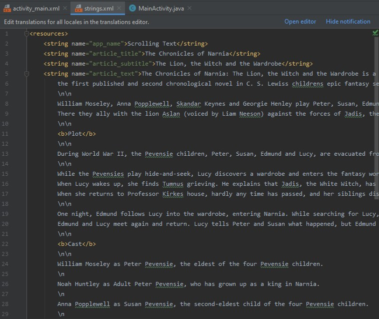
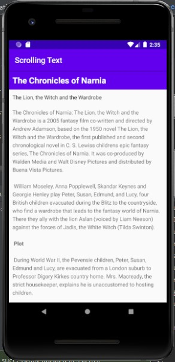
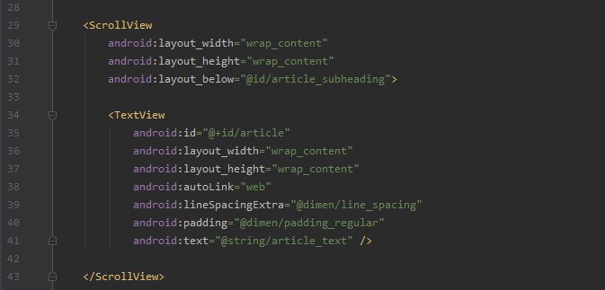
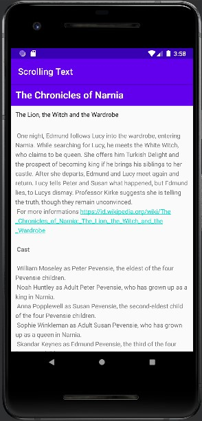
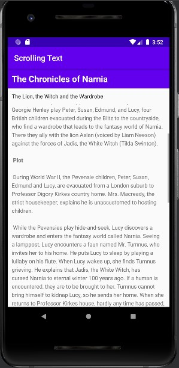
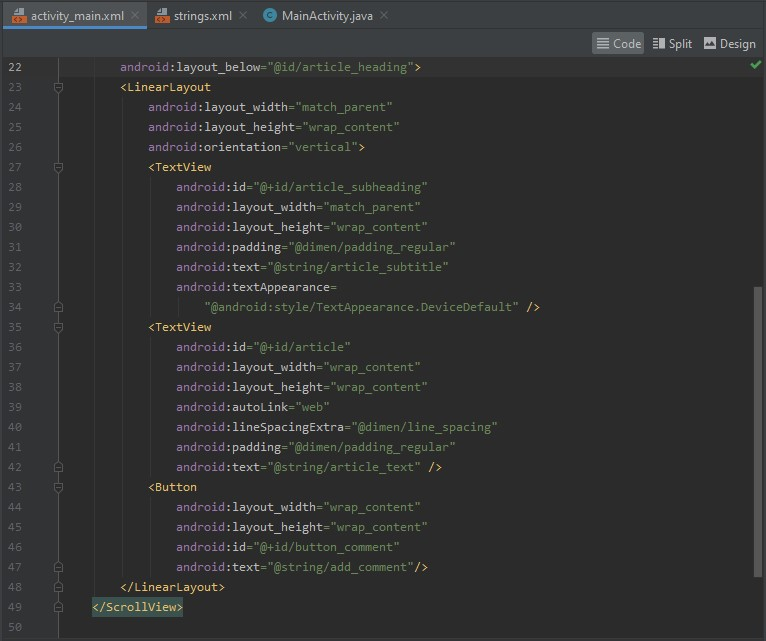

# 05 - ScrollView

## Tujuan Pembelajaran

1. Mahasiswa mampu memahami konsep penggunaan View Model pada aplikasi Android.
2. Mahasiswa mampu menerapkan konsep ViewModel pada aplikasi Android.

## Hasil Praktikum

### Tugas 1: Menambahkan dan mengedit elemen TextView ###

1. Membuat project dan elemen TextView
2. Menambahkan Teks dari Artikel

**Tampilan Keseluruhan Tugas 1**

| Keterangan | Gambar |
|--|--|
| activity_main.xml                  | |
|  strings.xml|  |
| Tampilan Ketika di Run  |  |

### Tugas 2: Menambahkan Scrollview dan Mengaktifkan Link Web ###

1. Tambahkan atribut tautan otomatis untuk tautan web aktif
2. Menambahkan ScrollView pada layout

**Tampilan Keseluruhan Tugas 2**

| Keterangan | Gambar |
|--|--|
| activity_main.xml                  |  |
| Tampilan Link Web  |  |
| Tampilan ScrollView  |  |

### Tugas 3: Scroll multiple elements ###

1. Menanbahkan LinearLayout pada ScrollView
2. Menambahkan ScrollView pada layout

**Tampilan Keseluruhan Tugas 2**

| Keterangan | Gambar |
|--|--|
| activity_main.xml                  |  |
| Tampilan Link Web  |  |
| Tampilan ScrollView  |  |

**Challenge**
Source Code

**Hasil Ketika Aplikasi di Run**

