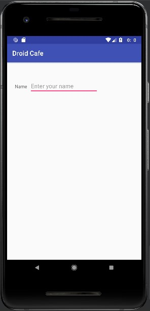
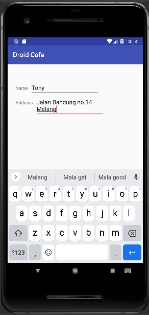
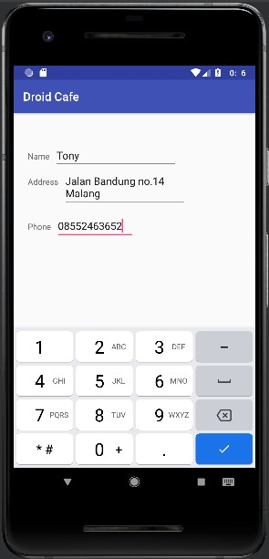
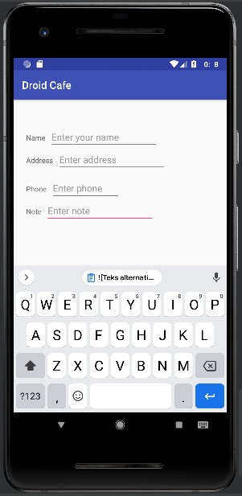
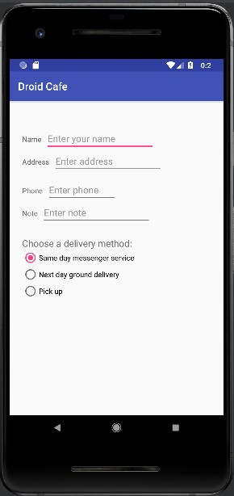
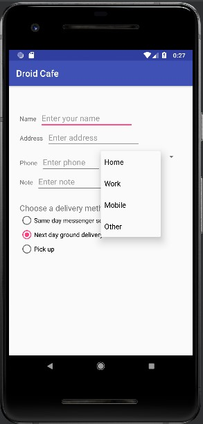
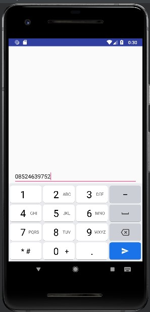
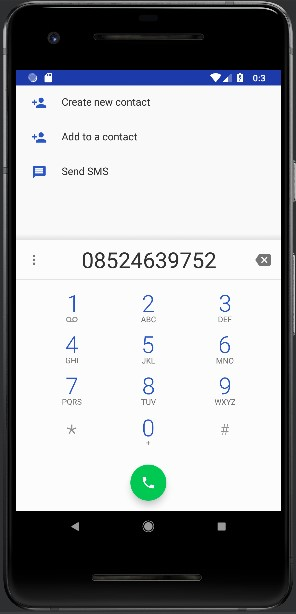
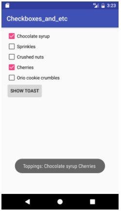

# 06 - Input Controls

## Tujuan Pembelajaran

1. How to change the input methods to enable suggestions, auto-capitalization, and password obfuscation.
2. How to change the generic on-screen keyboard to a phone keypad or other specialized keyboards.
3. How to add radio buttons for the user to select one item from a set of items.
4. How to add a spinner to show a drop-down menu with values, from which the user can select one.

## Hasil Praktikum

### Task 1: Experiment with text entry attributes

1. Add an EditText for entering a name

        <TextView
                android:id="@+id/nama_label"
                android:layout_width="wrap_content"
                android:layout_height="wrap_content"
                android:layout_marginStart="24dp"
                android:layout_marginLeft="24dp"
                android:layout_marginTop="32dp"
                android:text="@string/name_label_text"
                app:layout_constraintStart_toStartOf="parent"
                app:layout_constraintTop_toBottomOf="@id/order_textview"/>

        <EditText
                android:id="@+id/name_text"
                android:layout_width="wrap_content"
                android:layout_height="wrap_content"
                android:layout_marginLeft="8dp"
                android:layout_marginStart="8dp"
                android:ems="10"
                android:hint="@string/enter_name_hint"
                android:inputType="textPersonName"
                app:layout_constraintBaseline_toBaselineOf="@id/nama_label"
                app:layout_constraintStart_toEndOf="@id/nama_label"/>
- Run app 

2. Add a multiple-line EditText

        <TextView
                android:id="@+id/address_label"
                android:layout_width="wrap_content"
                android:layout_height="wrap_content"
                android:layout_marginLeft="24dp"
                android:layout_marginStart="24dp"
                android:layout_marginTop="24dp"
                android:text="@string/address_label_text"
                app:layout_constraintStart_toStartOf="parent"
                app:layout_constraintTop_toBottomOf="@id/nama_label" />

        <EditText
            android:id="@+id/address_text"
            android:layout_width="wrap_content"
            android:layout_height="wrap_content"
            android:layout_marginStart="8dp"
            android:layout_marginLeft="8dp"
            android:ems="10"
            android:hint="@string/enter_address_hint"
            android:inputType="textMultiLine"
            app:layout_constraintBaseline_toBaselineOf="@id/address_label"
            app:layout_constraintStart_toEndOf="@id/address_label"/>

- Run app

3. Use a keypad for phone numbers

        <TextView
                android:id="@+id/phone_label"
                android:layout_width="wrap_content"
                android:layout_height="wrap_content"
                android:layout_marginStart="24dp"
                android:layout_marginLeft="24dp"
                android:layout_marginTop="24dp"
                android:text="@string/phone_label_text"
                app:layout_constraintStart_toStartOf="parent"
                app:layout_constraintTop_toBottomOf="@id/address_text"/>

        <EditText
            android:id="@+id/phone_text"
            android:layout_width="134dp"
            android:layout_height="wrap_content"
            android:layout_marginStart="8dp"
            android:layout_marginLeft="8dp"
            android:ems="10"
            android:hint="@string/enter_phone_hint"
            android:inputType="phone"
            app:layout_constraintBaseline_toBaselineOf="@id/phone_label"
            app:layout_constraintStart_toEndOf="@id/phone_label"/>

- Run app

4. Combine input types in one EditText

        <TextView
                android:id="@+id/note_label"
                android:layout_width="wrap_content"
                android:layout_height="wrap_content"
                android:layout_marginStart="24dp"
                android:layout_marginLeft="24dp"
                android:layout_marginTop="24dp"
                android:text="@string/note_label_text"
                app:layout_constraintStart_toStartOf="parent"
                app:layout_constraintTop_toBottomOf="@id/phone_label"/>

        <EditText
            android:id="@+id/note_text"
            android:layout_width="wrap_content"
            android:layout_height="wrap_content"
            android:layout_marginStart="8dp"
            android:layout_marginLeft="8dp"
            android:ems="10"
            android:hint="@string/enter_note_hint"
            android:inputType="textCapSentences|textMultiLine"
            app:layout_constraintBaseline_toBaselineOf="@id/note_label"
            app:layout_constraintStart_toEndOf="@id/note_label" />

- Run app

### Task 2: Use radio buttons

1. Add a RadioGroup and radio buttons

        <TextView
                android:id="@+id/delivery_label"
                android:layout_width="wrap_content"
                android:layout_height="wrap_content"
                android:layout_marginStart="24dp"
                android:layout_marginLeft="24dp"
                android:layout_marginTop="24dp"
                android:text="@string/choose_delivery_method"
                android:textSize="18sp"
                app:layout_constraintStart_toStartOf="parent"
                app:layout_constraintTop_toBottomOf="@id/note_text"/>

            <RadioGroup
                android:layout_width="wrap_content"
                android:layout_height="wrap_content"
                android:layout_marginLeft="24dp"
                android:layout_marginStart="24dp"
                android:orientation="vertical"
                app:layout_constraintStart_toStartOf="parent"
                app:layout_constraintTop_toBottomOf="@id/delivery_label">

                <RadioButton
                    android:id="@+id/sameday"
                    android:layout_width="wrap_content"
                    android:layout_height="wrap_content"
                    android:onClick="onRadioButtonClicked"
                    android:text="@string/same_day_messenger_service" />

                <RadioButton
                    android:id="@+id/nextday"
                    android:layout_width="wrap_content"
                    android:layout_height="wrap_content"
                    android:checked="true"
                    android:onClick="onRadioButtonClicked"
                    android:text="@string/next_day_ground_delivery" />

                <RadioButton
                    android:id="@+id/pickup"
                    android:layout_width="wrap_content"
                    android:layout_height="wrap_content"
                    android:onClick="onRadioButtonClicked"
                    android:text="@string/pick_up" />
            </RadioGroup>

- Add the radio button click handler

        public void onRadioButtonClicked(View view) {
                // Is the button now checked
                boolean checked = ((RadioButton) view).isChecked();
                // Check which radio button was clicked
                switch (view.getId()){
                    case R.id.sameday:
                        if(checked)
                            // Same day service
                            displayToast(getString(R.string.same_day_messenger_service));
                        break;
                    case R.id.nextday:
                        if (checked)
                            //Next day delivery
                            displayToast(getString(R.string.next_day_ground_delivery));
                        break;
                    case R.id.pickup:
                        if (checked)
                            // Pick up
                            displayToast(getString(R.string.pick_up));
                        break;
                    default:
                        // Do nothing
                        break;
                }
            }

- Run app

### Coding challenge

        <RadioButton
                    android:id="@+id/nextday"
                    android:layout_width="wrap_content"
                    android:layout_height="wrap_content"
                    android:checked="true"
                    android:onClick="onRadioButtonClicked"
                    android:text="@string/next_day_ground_delivery" />

- Run app

### Task 3: Use a spinner for user choices

1. Add a spinner to the layout

        <Spinner
                android:id="@+id/label_spinner"
                android:layout_width="0dp"
                android:layout_height="wrap_content"
                android:layout_marginEnd="24dp"
                android:layout_marginRight="24dp"
                android:layout_marginLeft="8dp"
                android:layout_marginTop="8dp"
                app:layout_constraintEnd_toEndOf="parent"
                app:layout_constraintStart_toEndOf="@+id/phone_text"
                app:layout_constraintTop_toBottomOf="@+id/address_text"/>
        
        <EditText
                android:id="@+id/phone_text"
                android:layout_width="134dp"
                android:layout_height="wrap_content"
                android:layout_marginStart="8dp"
                android:layout_marginLeft="8dp"
                android:ems="10"
                android:hint="@string/enter_phone_hint"
                android:inputType="phone"
                app:layout_constraintBaseline_toBaselineOf="@id/phone_label"
                app:layout_constraintStart_toEndOf="@id/phone_label"/>

2. Add code to activate the Spinner and its listener

        <string-array name="labels_array">
                <item>Home</item>
                <item>Work</item>
                <item>Mobile</item>
                <item>Other</item>
            </string-array>

        if (spinner != null){
                    spinner.setOnItemSelectedListener(this);
                }
                //Create ArrayAdapter using the string array and default spinner layout
                ArrayAdapter<CharSequence> adapter = ArrayAdapter.createFromResource(this,
                        R.array.labels_array, android.R.layout.simple_spinner_item);
                //Specify the layout to use when the list of choices appears.
                adapter.setDropDownViewResource(android.R.layout.simple_spinner_dropdown_item);
                //Apply the adapter to the spinner.
                if (spinner != null){
                    spinner.setAdapter(adapter);
                }

3. Add code to respond to Spinner selections

        @Override
            public void onItemSelected(AdapterView<?> adapterView, View view, int i, long l) {
                String spinnerLabel = adapterView.getItemAtPosition(i).toString();
                displayToast(spinnerLabel);
            }
- Run app

## Coding challenge 2

- Edit Text

        <EditText
                android:id="@+id/editText_main"
                android:layout_width="match_parent"
                android:layout_height="wrap_content"
                android:layout_alignParentBottom="true"
                android:inputType="phone"
                android:imeOptions="actionSend"
                android:hint="@string/enter_phone" />

- Main Activity

        EditText editText = findViewById(R.id.editText_main);
                if(editText != null)
                    editText.setOnEditorActionListener(new TextView.OnEditorActionListener() {
                        @Override
                        public boolean onEditorAction(TextView textView, int actionId, KeyEvent event) {
                            boolean handled = false;
                            if (actionId == EditorInfo.IME_ACTION_SEND){
                                dialNumber();
                                handled = true;
                            }
                            return handled;
                        }
                    });
        
        private void dialNumber(){
                EditText editText = findViewById(R.id.editText_main);
                String phoneNum = null;
                // If the editText field is not null.
                // concatenate "tel: " with the phone number string
                if (editText != null) phoneNum = "tel:"+ editText.getText().toString();
                // Optional: log the concatenated phone number for dialing.
                Log.d("dialNumber: ","phoneNum");
                // Specify the intent
                Intent intent = new Intent(Intent.ACTION_DIAL);
                // Set the data fpr the intent as the phone number
                intent.setData(Uri.parse(phoneNum));
                // If the intent resolves to a package (app)
                // start the activity with the intent
                if (intent.resolveActivity(getPackageManager()) != null){
                    startActivity(intent);
                }else{
                    Log.d("ImplicitIntents", "Can't handle this!");
                }
    }

- Run app

## Homework

- Activity_main

        <?xml version="1.0" encoding="utf-8"?>
        <LinearLayout xmlns:android="http://schemas.android.com/apk/res/android"
            xmlns:app="http://schemas.android.com/apk/res-auto"
            xmlns:tools="http://schemas.android.com/tools"
            android:layout_width="match_parent"
            android:layout_height="match_parent"
            android:orientation="vertical"
            tools:context=".MainActivity">

            <CheckBox
                android:id="@+id/checkBox"
                android:layout_width="match_parent"
                android:layout_height="wrap_content"
                android:text="@string/chocolate_syrup"
                android:layout_marginTop="16dp"
                android:textSize="18sp" />

            <CheckBox
                android:id="@+id/checkBox2"
                android:layout_width="match_parent"
                android:layout_height="wrap_content"
                android:text="@string/sprinkles"
                android:layout_marginTop="16dp"
                android:textSize="18sp" />

            <CheckBox
                android:id="@+id/checkBox3"
                android:layout_width="match_parent"
                android:layout_height="wrap_content"
                android:layout_marginTop="16dp"
                android:text="@string/crushed_nuts"
                android:textSize="18sp"
                tools:layout_editor_absoluteX="382dp" />

            <CheckBox
                android:id="@+id/checkBox4"
                android:layout_width="match_parent"
                android:layout_height="wrap_content"
                android:text="@string/cheeries"
                android:layout_marginTop="16dp"
                android:textSize="18sp"
                tools:layout_editor_absoluteX="386dp" />

            <CheckBox
                android:id="@+id/checkBox5"
                android:layout_width="match_parent"
                android:layout_height="wrap_content"
                android:text="@string/orio_cookie_crumbles"
                android:layout_marginTop="16dp"
                android:textSize="18sp"
                app:layout_constraintTop_toBottomOf="@+id/checkBox"
                tools:layout_editor_absoluteX="386dp" />

            <Button
                android:id="@+id/button"
                android:layout_width="wrap_content"
                android:layout_height="wrap_content"
                android:onClick="Check"
                android:text="@string/show_toast"/>

        </LinearLayout>

- Main_Activity

        package org.example.checkboxes;

        import androidx.appcompat.app.AppCompatActivity;

        import android.os.Bundle;
        import android.view.View;
        import android.widget.CheckBox;
        import android.widget.Toast;

        public class MainActivity extends AppCompatActivity {
            CheckBox ch, ch1, ch2, ch3, ch4;

            @Override
            protected void onCreate(Bundle savedInstanceState) {
                super.onCreate(savedInstanceState);
                setContentView(R.layout.activity_main);

                ch=(CheckBox)findViewById(R.id.checkBox);
                ch1=(CheckBox)findViewById(R.id.checkBox2);
                ch2=(CheckBox)findViewById(R.id.checkBox3);
                ch3=(CheckBox)findViewById(R.id.checkBox4);
                ch4=(CheckBox)findViewById(R.id.checkBox5);
            }

            public void Check(View v)
            {
                String msg="";

                // Concatenation of the checked options in if

                // isChecked() is used to check whether
                // the CheckBox is in true state or not.

                if(ch.isChecked())
                    msg = msg + getString(R.string.chocolate_syrup);
                if(ch1.isChecked())
                    msg = msg + getString(R.string.sprinkles);
                if(ch2.isChecked())
                    msg = msg + getString(R.string.crushed_nuts);
                if(ch3.isChecked())
                    msg = msg + getString(R.string.cheeries);
                if(ch4.isChecked())
                    msg = msg + getString(R.string.orio_cookie_crumbles);

                // Toast is created to display the
                // message using show() method.
                Toast.makeText(this, "Toppings : "+msg ,
                        Toast.LENGTH_LONG).show();
            }
        }

- Run app

## Question

Question 1

- What's the most important difference between checkboxes and a RadioGroup of radio buttons? Choose one:

Jawab :
The major difference is that checkboxes enable multiple selections, while a RadioGroup allows only one selection.

Question 2

- Which layout group lets you align a set of CheckBox elements vertically? Choose one:

Jawab :
LinearLayout

Question 3

- Which of the following is the method of the Checkable interface to check the state of a radio button (that is, whether it has been selected or not)?

Jawab :
onRadioButtonClicked()