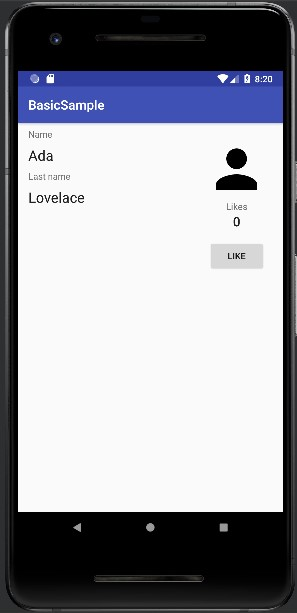
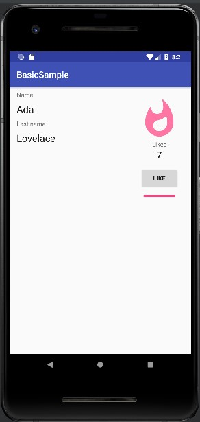

# 08 - Data Binding

## Tujuan Pembelajaran

1. The Data Binding Library is an Android Jetpack library that allows you to bind UI components in your XML layouts to data sources in your app using a declarative format rather than programmatically, reducing boilerplate code.

## Hasil Praktikum

### Enable Data Binding and convert the layout

- Open plain_activity.xml. It is a regular layout with a ConstraintLayout as the root element.

        <layout xmlns:android="http://schemas.android.com/apk/res/android"
            xmlns:app="http://schemas.android.com/apk/res-auto"
            xmlns:tools="http://schemas.android.com/tools">
        <data>

        </data>
        <androidx.constraintlayout.widget.ConstraintLayout
                android:layout_width="match_parent"
                android:layout_height="match_parent">

## Create your first layout expression

- Create two String layout variables inside the <data> tag.

        <data>
                <variable name="name" type="String"/>
                <variable name="lastName" type="String"/>
            </data>

- Look for the TextView with the ID plain_name and add the android:text attribute with a layout expression:

        <TextView
                android:id="@+id/plain_name"
                android:text="@{name}" 
        ... />

- Do the same thing with the plain_lastName text view:

        <TextView
                        android:id="@+id/plain_lastname"
                        android:text="@{lastName}"
                ... />

### Change inflation and remove UI calls from activity

-  Open PlainOldActivity. Because you're using a Data Binding layout, the inflation is done in a different way.

In onCreate, replace:

    setContentView(R.layout.plain_activity)

with:

    val binding : PlainActivityBinding =
        DataBindingUtil.setContentView(this, R.layout.plain_activity)

- Now you can set the variable values:

        binding.name = "Your name"
            binding.lastName = "Your last name"

- Remove the updateName() method, since the new Data Binding code is now finding the IDs and setting the text values.

- Remove the updateName() call in onCreate().

### Dealing with user events

- First, replace the two variables for a single ViewModel. This is the way to go in the majority of cases since it keeps your presentation code and state in one place.

        <data>
                <variable
                        name="viewmodel"
                        type="com.example.android.databinding.basicsample.data.SimpleViewModel"/>
            </data>

- Change the layout expressions in both TextViews:

        <TextView
                        android:id="@+id/plain_name"
                        android:text="@{viewmodel.name}"
        ... />
                <TextView
                        android:id="@+id/plain_lastname"
                        android:text="@{viewmodel.lastName}"
        ... />

- Look for the like_button Button and replace

        android:onClick="onLike"

with

    android:onClick="@{() -> viewmodel.onLike()}"

### Observing data

- Open SimpleViewModel.kt

Replace

    val name = "Grace"
    val lastName = "Hopper"
    var likes = 0
        private set // This is to prevent external modification of the variable.

with the new LiveDatas:

    private val _name = MutableLiveData("Ada")
    private val _lastName = MutableLiveData("Lovelace")
    private val _likes =  MutableLiveData(0)

    val name: LiveData<String> = _name
    val lastName: LiveData<String> = _lastName
    val likes: LiveData<Int> = _likes

Also, replace

    fun onLike() {
        likes++
    }

    /**
     * Returns popularity in buckets: [Popularity.NORMAL],
     * [Popularity.POPULAR] or [Popularity.STAR]
     */
    val popularity: Popularity
        get() {
            return when {
                likes > 9 -> Popularity.STAR
                likes > 4 -> Popularity.POPULAR
                else -> Popularity.NORMAL
            }
        }

with

        // popularity is exposed as LiveData using a Transformation instead of a @Bindable property.
        val popularity: LiveData<Popularity> = Transformations.map(_likes) {
            when {
                it > 9 -> Popularity.STAR
                it > 4 -> Popularity.POPULAR
                else -> Popularity.NORMAL
            }
        }

        fun onLike() {
            _likes.value = (_likes.value ?: 0) + 1
        }

- Open PlainOldActivity and set the lifecycle owner in the binding object:

        binding.lifecycleOwner = this

- Open PlainOldActivity and remove all the private methods in the activity and their calls. The activity is now as simple as it gets.

        class PlainOldActivity : AppCompatActivity() {

            // Obtain ViewModel from ViewModelProviders
            private val viewModel by lazy { ViewModelProviders.of(this).get(SimpleViewModel::class.java) }

            override fun onCreate(savedInstanceState: Bundle?) {
                super.onCreate(savedInstanceState)

                val binding : PlainActivityBinding =
                    DataBindingUtil.setContentView(this, R.layout.plain_activity)

                binding.lifecycleOwner = this

                binding.viewmodel = viewModel
            }
        }

- Let's bind the TextView showing the number of likes to the observable integer. In plain_activity.xml:

        <TextView
                        android:id="@+id/likes"
                        android:text="@{Integer.toString(viewmodel.likes)}"

### Using Binding Adapters to create custom attributes

- In the plain_activity layout, look for the progress bar and add the hideIfZero attribute:

        <ProgressBar
                    android:id="@+id/progressBar"
                    app:hideIfZero="@{viewmodel.likes}"

- Run the app and you'll see that the progress bar shows up when you click for the first time on the button. However, we still need to change its value and color:

### Create a Binding Adapter with multiple parameters

- The requireAll parameter defines when the binding adapter is used:

- When true, all elements must be present in the XML definition.
- When false, the missing attributes will be null, false if booleans, or 0 if primitives.

Next, add the attributes to the XML:

        <ProgressBar
                        android:id="@+id/progressBar"
                        app:hideIfZero="@{viewmodel.likes}"
                        app:progressScaled="@{viewmodel.likes}"
                        android:max="@{100}"

### Practice creating Binding Adapters

- Run Apps

 