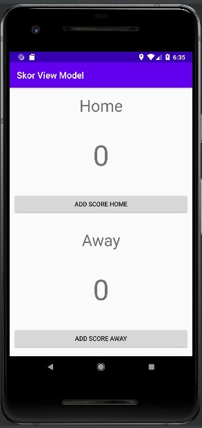
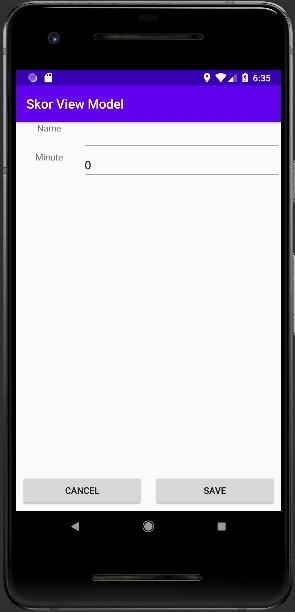
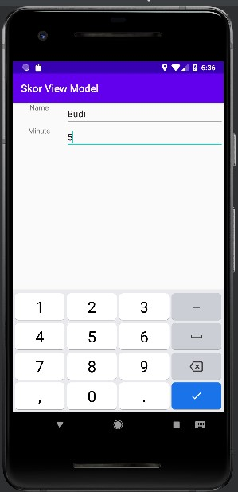
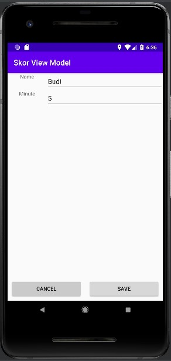
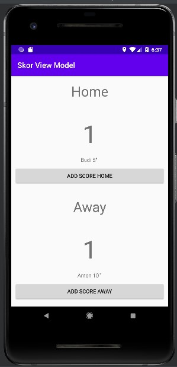

# 10 - View Models

## Tujuan Pembelajaran

1. Mahasiswa mengenal tentang arsitektur MVVM.
2. Mahasiswa memahami lifecycle viewmodel pada MVVM.
3. Mahasiswa mampu menerapkan viewmodel pada Android.

## Hasil Praktikum

1. Pada project skor dibutuhkan dua informasi skor pada tim Home dan Away sehingga dibutuhkan dua buah atribut livedata. Tambahkan kode seperti yang ada di bawah.

ScoreViewModel.java

        public class ScoreViewModel extends ViewModel {
            private final MutableLiveData<ArrayList<GoalScorer>> homeGoalScorerList =
                    new MutableLiveData<>(new ArrayList<GoalScorer>());
            private final MutableLiveData<ArrayList<GoalScorer>> awayGoalScorerList =
                    new MutableLiveData<>(new ArrayList<GoalScorer>());
        }

2. Penggunaan ViewModel bertujuan juga untuk memisahkan logika dengan UI. Tambahkan logika untuk menampilkan nilai Skor masing-masing tim pada viewmodel.

ScoreViewModel.java

        public int getHomeScore() {
                return homeGoalScorerList.getValue().size();
            }

            public int getAwayScore() {
                return awayGoalScorerList.getValue().size();
            }

3. Tambahkan logika untuk penambahan pencetak gol dengan kode sebagai berikut. Penambahan pencetak gol berdasarkan informasi tim yang mencetak gol.

ScoreViewModel.java

        public void setGoalScorer(String team, GoalScorer goalScorer) {
            if (team.equals(ScoreFragment.HOME)) {
                homeGoalScorerList.getValue().add(goalScorer);
            } else {
                awayGoalScorerList.getValue().add(goalScorer);
            }
        }

4. Selain pemisahan logika, dalam viewmodel juga dapat digunakan untuk pemisahan interaksi dengan pengguna. Tambahkan kode berikut untuk menambahkan interaksi pada tombol.

ScoreViewModel.java

        public void onAddHomeClick(View view) {
            ScoreFragmentDirections.GoalScorerAction action =
            ScoreFragmentDirections.goalScorerAction(ScoreFragment.HOME);
            Navigation.findNavController(view).navigate(action);
        }

        public void onAddAwayClick(View view) {
            ScoreFragmentDirections.GoalScorerAction action =
            ScoreFragmentDirections.goalScorerAction(ScoreFragment.AWAY);
            Navigation.findNavController(view).navigate(action);
        }

5. Buka berkas ScoreFragment.java dan lakukan instansiasi viewmodel pada method onCreateView().

    viewModel = new ViewModelProvider(requireActivity()).get(ScoreViewModel.class)

6. Buka kembali berkas ScoreFragment.java, dalam project ini digunakan juga databinding sehingga perlu proses untuk menghubungkan viewmodel. Tambahkan proses binding viewmodel dengan kode berikut.

        binding.setVm(viewModel);

7. Kemudian untuk menambahkan interaksi penambahan pencetak gol, silahkan tambahkan kode berikut pada method onSaveClicked()

        public void onSaveClicked(View view) {
        Bundle bundle = new Bundle();
        bundle.putParcelable(ScoreFragment.SCORER_KEY, goalScorer);

        viewModel.setGoalScorer(requestKey, goalScorer);
        Navigation.findNavController(view).navigateUp();
        }

## Challange 

1. Tampilkan data pemain beserta menit gol terjadi untuk masing-masing tim pada id text_home_scorer dan text_away_scorer dengan menggunakan konsep viewmodel.

- Hasil Akhir

 

 

