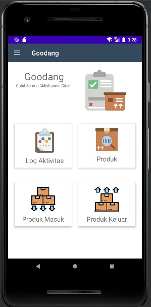
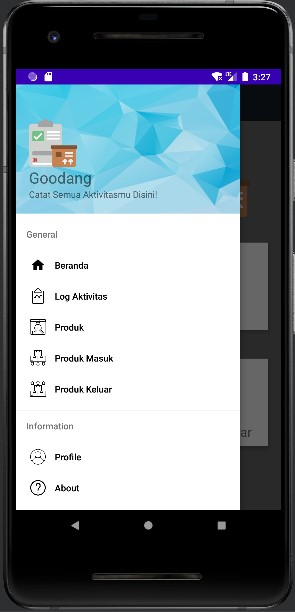
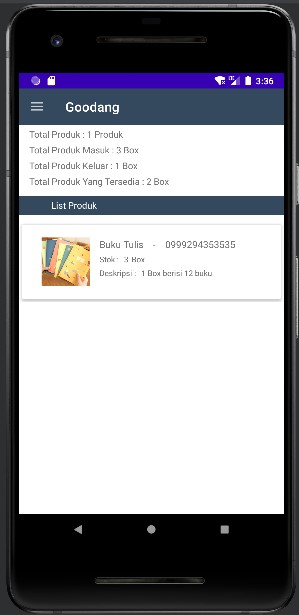

# 11 - Kuis 2

## Soal Kuis 2

1. Implementasikan materi/pertemuan sebelumnya tentang data binding, fragment, navigation, dan ViewModel pada ide project akhir Anda! (minimal 1 fitur tiap materi tersebut) Cantumkan tautan github Anda yang tertuju pada file markdown (.md) berisi screenshot tiap fitur tersebut.

2. Jelaskan perbedaan Data Binding dan ViewModel ? lalu pada saat kapan harus menggunakan Data Binding dan ViewModel ? (Mohon cantumkan referensinya).

3. Jelaskan perbedaan fragment dan Activity ? lalu pada saat kapan harus menggunakan fragment dan Activity ? (Mohon cantumkan referensinya).

## Jawab Kuis 2

1. Hasil data binding, fragment, navigation, dan viewmodel :

- Data binding

### Source code

build.gradle(:app)

    dataBinding {
            enabled true
        }

Produk.java

    public class Produk {

        public final String nama, kode, deskripsi;
        public final int stok;

        public Produk(String nama, String kode, String deskripsi, int stok) {
            this.nama = nama;
            this.kode = kode;
            this.deskripsi = deskripsi;
            this.stok = stok;
        }

    }

- Viewmodel

### Source code

build.gradle(:app)

    dependencies {

        implementation 'androidx.appcompat:appcompat:1.2.0'
        implementation 'com.google.android.material:material:1.2.1'
        implementation 'androidx.constraintlayout:constraintlayout:2.0.2'
        implementation 'androidx.lifecycle:lifecycle-viewmodel:2.2.0'
        testImplementation 'junit:junit:4.+'
        androidTestImplementation 'androidx.test.ext:junit:1.1.2'
        androidTestImplementation 'androidx.test.espresso:espresso-core:3.3.0'
    }

ProdukViewModel.java

    public class ProdukViewModel extends ViewModel {

        public MutableLiveData<Produk> produk = new MutableLiveData<>();

        public void setProduk(Produk produk) {
            this.produk.setValue(produk);
        }
    }

fragment_produk.xml

    <layout xmlns:android="http://schemas.android.com/apk/res/android"
    xmlns:app="http://schemas.android.com/apk/res-auto"
    xmlns:tools="http://schemas.android.com/tools">

        <data>
            <variable
                name="viewmodel"
                type="com.example.goodang.ProdukViewModel" />
        </data>

        <androidx.constraintlayout.widget.ConstraintLayout
            android:layout_height="match_parent"
            android:layout_width="match_parent">

            <LinearLayout
                android:id="@+id/linier"
                android:layout_height="100dp"
                android:layout_marginTop="?attr/actionBarSize"
                android:layout_width="0dp"
                android:orientation="vertical"
                app:layout_constraintEnd_toEndOf="parent"
                app:layout_constraintHorizontal_bias="0.542"
                app:layout_constraintStart_toStartOf="parent"
                app:layout_constraintTop_toTopOf="parent">

                <TextView
                    android:id="@+id/textView"
                    android:layout_height="wrap_content"
                    android:layout_marginStart="16dp"
                    android:layout_marginTop="5dp"
                    android:layout_width="152dp"
                    android:text="Total Produk : 1 Produk"
                    app:layout_constraintStart_toStartOf="parent"
                    app:layout_constraintTop_toBottomOf="@+id/linear" />

                <TextView
                    android:id="@+id/textView2"
                    android:layout_height="wrap_content"
                    android:layout_marginStart="16dp"
                    android:layout_marginTop="5dp"
                    android:layout_width="wrap_content"
                    android:text="Total Produk Masuk : 3 Box"
                    app:layout_constraintStart_toStartOf="parent"
                    app:layout_constraintTop_toBottomOf="@+id/textView" />

                <TextView
                    android:id="@+id/textView3"
                    android:layout_height="wrap_content"
                    android:layout_marginStart="16dp"
                    android:layout_marginTop="5dp"
                    android:layout_width="wrap_content"
                    android:text="Total Produk Keluar : 1 Box"
                    app:layout_constraintStart_toStartOf="parent"
                    app:layout_constraintTop_toBottomOf="@+id/textView2" />

                <TextView
                    android:id="@+id/textView4"
                    android:layout_height="wrap_content"
                    android:layout_marginStart="16dp"
                    android:layout_marginTop="5dp"
                    android:layout_width="wrap_content"
                    android:text="Total Produk Yang Tersedia : 2 Box"
                    app:layout_constraintStart_toStartOf="parent"
                    app:layout_constraintTop_toBottomOf="@+id/textView3" />
            </LinearLayout>

            <LinearLayout
                android:background="@color/splash_screen"
                android:id="@+id/linier2"
                android:layout_height="30dp"
                android:layout_marginTop="10dp"
                android:layout_width="0dp"
                android:orientation="vertical"
                app:layout_constraintEnd_toEndOf="parent"
                app:layout_constraintHorizontal_bias="1.0"
                app:layout_constraintStart_toStartOf="parent"
                app:layout_constraintTop_toBottomOf="@+id/linier">

                <TextView
                    android:id="@+id/textView5"
                    android:layout_height="wrap_content"
                    android:layout_marginLeft="50dp"
                    android:layout_marginTop="5dp"
                    android:layout_width="wrap_content"
                    android:text="List Produk"
                    android:textColor="@color/white"
                    android:textSize="14dp" />

            </LinearLayout>

            <LinearLayout
                android:layout_height="125dp"
                android:layout_marginTop="10dp"
                android:layout_width="0dp"
                android:orientation="horizontal"
                app:layout_constraintEnd_toEndOf="parent"
                app:layout_constraintHorizontal_bias="1.0"
                app:layout_constraintStart_toStartOf="parent"
                app:layout_constraintTop_toBottomOf="@+id/linier2">

                <androidx.cardview.widget.CardView
                    android:layout_height="match_parent"
                    android:layout_margin="5dp"
                    android:layout_weight="1"
                    android:layout_width="0dp"
                    app:cardElevation="5dp">

                    <RelativeLayout
                        android:layout_height="match_parent"
                        android:layout_width="match_parent">

                        <ImageView
                            android:id="@+id/img_pro"
                            android:layout_centerVertical="true"
                            android:layout_height="75dp"
                            android:layout_marginLeft="30dp"
                            android:layout_width="75dp"
                            app:srcCompat="@drawable/cetak_buku_tulis_sekolah" />

                        <TextView
                            android:id="@+id/nama_produk"
                            android:layout_height="wrap_content"
                            android:layout_marginLeft="15dp"
                            android:layout_marginTop="20dp"
                            android:layout_toRightOf="@+id/img_pro"
                            android:layout_width="wrap_content"
                            android:text="@{viewmodel.produk.nama}"
                            android:textSize="15dp" />

                        <TextView
                            android:id="@+id/garis"
                            android:layout_height="wrap_content"
                            android:layout_marginLeft="15dp"
                            android:layout_marginTop="20dp"
                            android:layout_toRightOf="@+id/nama_produk"
                            android:layout_width="wrap_content"
                            android:text="-"
                            android:textSize="15dp" />

                        <TextView
                            android:id="@+id/kode_produk"
                            android:layout_height="wrap_content"
                            android:layout_marginLeft="15dp"
                            android:layout_marginTop="20dp"
                            android:layout_toRightOf="@+id/garis"
                            android:layout_width="wrap_content"
                            android:text="@{viewmodel.produk.kode}"
                            android:textSize="15dp" />

                        <TextView
                            android:id="@+id/stok"
                            android:layout_below="@+id/nama_produk"
                            android:layout_height="wrap_content"
                            android:layout_marginLeft="15dp"
                            android:layout_marginTop="5dp"
                            android:layout_toRightOf="@+id/img_pro"
                            android:layout_width="wrap_content"
                            android:text="Stok : "
                            android:textSize="12dp" />

                        <TextView
                            android:id="@+id/stok_produk"
                            android:layout_below="@+id/nama_produk"
                            android:layout_height="wrap_content"
                            android:layout_marginLeft="15dp"
                            android:layout_marginTop="5dp"
                            android:layout_toRightOf="@+id/stok"
                            android:layout_width="wrap_content"
                            android:text="@{String.valueOf(viewmodel.produk.stok)}"
                            android:textSize="12dp" />

                        <TextView
                            android:id="@+id/des_produk"
                            android:layout_below="@+id/stok_produk"
                            android:layout_height="wrap_content"
                            android:layout_marginLeft="15dp"
                            android:layout_marginTop="5dp"
                            android:layout_toRightOf="@+id/img_pro"
                            android:layout_width="wrap_content"
                            android:text="@{viewmodel.produk.deskripsi}"
                            android:textSize="12dp" />

                    </RelativeLayout>
                </androidx.cardview.widget.CardView>

            </LinearLayout>

        </androidx.constraintlayout.widget.ConstraintLayout>
    </layout>

ProdukFragment.java

    public class ProdukFragment extends Fragment{

        private ProdukViewModel viewModel;

        @Override
        public void onCreate(@Nullable Bundle savedInstanceState) {
            super.onCreate(savedInstanceState);
        }

        @Override
        public View onCreateView( LayoutInflater inflater,  ViewGroup container,  Bundle savedInstanceState) {
            FragmentProdukBinding fragmentProdukBinding = DataBindingUtil.inflate(inflater, R.layout.fragment_produk, container, false);
            viewModel = new ViewModelProvider(this).get(ProdukViewModel.class);
            fragmentProdukBinding.setViewmodel(viewModel);

            Produk produk = new Produk("Buku Tulis", "0999294353535", "1 Box berisi 12 buku", 3);
            viewModel.setProduk(produk);

            return fragmentProdukBinding.getRoot();
        }
    }

- Fragment

### Source code

containt_main.xml

    <LinearLayout
        xmlns:android="http://schemas.android.com/apk/res/android"
        android:layout_width="match_parent"
        android:layout_height="match_parent"
        android:orientation="vertical">

        <FrameLayout
            android:layout_width="match_parent"
            android:layout_height="match_parent"
            android:id="@+id/container_fragment"/>

    </LinearLayout>

secondActivity.java

    public class secondActivity extends AppCompatActivity implements NavigationView.OnNavigationItemSelectedListener {

        //Variable
        DrawerLayout drawerLayout;
        NavigationView navigationView;
        Toolbar toolbar;
        FragmentManager fragmentManager;
        FragmentTransaction fragmentTransaction;

        @Override
        protected void onCreate(Bundle savedInstanceState) {
            super.onCreate(savedInstanceState);
            setContentView(R.layout.activity_second);

            /*----------------------------------Hooks--------------------------------*/
            drawerLayout = findViewById(R.id.drawer_layout);
            navigationView = findViewById(R.id.nav_view);
            toolbar = findViewById(R.id.toolbar);

            /*----------------------------------Toolbar--------------------------------*/
            setSupportActionBar(toolbar);

            /*----------------------------------Navigation Drawer Menu--------------------------------*/
            navigationView.bringToFront();
            ActionBarDrawerToggle toggle = new ActionBarDrawerToggle(this,drawerLayout,toolbar,R.string.nav_drawer_open,R.string.nav_drawer_close);
            drawerLayout.addDrawerListener(toggle);
            toggle.setDrawerIndicatorEnabled(true);
            toggle.syncState();

            navigationView.setNavigationItemSelectedListener(this);

            /*----------------------------------Default Fragment--------------------------------*/
            fragmentManager = getSupportFragmentManager();
            fragmentTransaction = fragmentManager.beginTransaction();
            fragmentTransaction.add(R.id.container_fragment, new MainFragment());
            fragmentTransaction.commit();

        }

        @Override
        public void onBackPressed() {

            if(drawerLayout.isDrawerOpen(GravityCompat.START)){
                drawerLayout.closeDrawer(GravityCompat.START);
            }else{
                super.onBackPressed();
            }
        }

        @Override
        public boolean onNavigationItemSelected(@NonNull MenuItem item) {

            drawerLayout.closeDrawer(GravityCompat.START);
            Fragment fragment = null;

            switch(item.getItemId()){
                case R.id.home:
                    fragmentManager = getSupportFragmentManager();
                    fragmentTransaction = fragmentManager.beginTransaction();
                    fragmentTransaction.replace(R.id.container_fragment, new MainFragment());
                    fragmentTransaction.commit();
                    break;
                case R.id.nav_log:

                    // break;
                case R.id.nav_produk:
                    fragmentManager = getSupportFragmentManager();
                    fragmentTransaction = fragmentManager.beginTransaction();
                    fragmentTransaction.replace(R.id.container_fragment, new ProdukFragment());
                    fragmentTransaction.commit();
                    break;
                case R.id.nav_masuk:

                    // break;
                case R.id.nav_keluar:

                    // break;
                default: //For all other cases, do this        break;
            }
            return true;
        }
    }

MainFragment.java

    public class MainFragment  extends Fragment{

        @Nullable
        @Override
        public View onCreateView(@NonNull LayoutInflater inflater, @Nullable ViewGroup container, @Nullable Bundle savedInstanceState) {
            View view = inflater.inflate(R.layout.fragment_home, container, false);
            return view;
        }

    }

fragment_home.xml

    <androidx.constraintlayout.widget.ConstraintLayout xmlns:android="http://schemas.android.com/apk/res/android"
        xmlns:tools="http://schemas.android.com/tools"
        android:layout_width="match_parent"
        android:layout_height="match_parent"
        android:id="@+id/fragment"
        xmlns:app="http://schemas.android.com/apk/res-auto"
        android:paddingTop="80dp">

        <TextView
            android:id="@+id/app_name"
            android:layout_width="0dp"
            android:layout_height="wrap_content"
            android:layout_marginStart="16dp"
            android:layout_marginTop="50dp"

            android:gravity="center"
            android:text="@string/app_name"
            android:textSize="30sp"
            app:layout_constraintEnd_toStartOf="@+id/imageView"
            app:layout_constraintStart_toStartOf="parent"
            app:layout_constraintTop_toBottomOf="@+id/toolbar" />

        <TextView
            android:id="@+id/textView5"
            android:layout_width="0dp"
            android:layout_height="wrap_content"
            android:layout_marginStart="16dp"
            android:gravity="center"
            android:text="Catat Semua Aktivitasmu Disini!"
            android:textSize="12sp"
            app:layout_constraintEnd_toStartOf="@+id/imageView"
            app:layout_constraintStart_toStartOf="parent"
            app:layout_constraintTop_toBottomOf="@+id/app_name" />

        <ImageView
            android:id="@+id/imageView"
            android:layout_width="0dp"
            android:layout_height="125dp"
            android:layout_marginTop="25dp"
            android:layout_marginEnd="16dp"
            app:layout_constraintEnd_toEndOf="parent"
            app:layout_constraintStart_toEndOf="@+id/textView5"
            app:layout_constraintTop_toBottomOf="@+id/toolbar"
            app:srcCompat="@drawable/logistics" />

        <LinearLayout
            android:layout_width="0dp"
            android:layout_height="175dp"
            android:layout_marginTop="20dp"
            android:orientation="horizontal"
            android:padding="10dp"
            app:layout_constraintEnd_toEndOf="parent"
            app:layout_constraintHorizontal_bias="1.0"
            app:layout_constraintStart_toStartOf="parent"
            app:layout_constraintTop_toBottomOf="@+id/imageView">

            <androidx.cardview.widget.CardView
                android:layout_width="0dp"
                android:layout_height="match_parent"
                android:layout_margin="10dp"
                android:layout_weight="1"
                app:cardElevation="5dp">

                <RelativeLayout
                    android:layout_width="186dp"
                    android:layout_height="151dp">

                    <TextView
                        android:id="@+id/textView6"
                        android:layout_width="wrap_content"
                        android:layout_height="wrap_content"
                        android:layout_below="@id/imageView2"
                        android:layout_centerHorizontal="true"
                        android:layout_marginTop="10dp"
                        android:text="Log Aktivitas"
                        android:textSize="20sp" />

                    <ImageView
                        android:id="@+id/imageView2"
                        android:layout_width="75dp"
                        android:layout_height="75dp"
                        android:layout_centerHorizontal="true"
                        android:layout_marginTop="15dp"
                        app:srcCompat="@drawable/dashboard" />
                </RelativeLayout>
            </androidx.cardview.widget.CardView>

            <androidx.cardview.widget.CardView
                android:layout_width="0dp"
                android:layout_height="match_parent"
                android:layout_margin="10dp"
                android:layout_weight="1"
                app:cardElevation="5dp">

                <RelativeLayout
                    android:layout_width="match_parent"
                    android:layout_height="match_parent">

                    <ImageView
                        android:id="@+id/imageView3"
                        android:layout_width="70dp"
                        android:layout_height="70dp"
                        android:layout_centerHorizontal="true"
                        android:layout_marginTop="15dp"
                        app:srcCompat="@drawable/barcode" />

                    <TextView
                        android:id="@+id/textView7"
                        android:layout_width="wrap_content"
                        android:layout_height="wrap_content"
                        android:layout_below="@id/imageView3"
                        android:layout_centerHorizontal="true"
                        android:layout_marginTop="10dp"
                        android:text="Produk"
                        android:textSize="20sp" />
                </RelativeLayout>

            </androidx.cardview.widget.CardView>

        </LinearLayout>

        <LinearLayout
            android:layout_width="0dp"
            android:layout_height="175dp"
            android:layout_marginTop="200dp"
            android:orientation="horizontal"
            android:padding="10dp"
            app:layout_constraintEnd_toEndOf="parent"
            app:layout_constraintHorizontal_bias="1.0"
            app:layout_constraintStart_toStartOf="parent"
            app:layout_constraintTop_toBottomOf="@+id/imageView">

            <androidx.cardview.widget.CardView
                android:layout_width="0dp"
                android:layout_height="match_parent"
                android:layout_margin="10dp"
                android:layout_weight="1"
                app:cardElevation="5dp">

                <RelativeLayout
                    android:layout_width="match_parent"
                    android:layout_height="match_parent">

                    <TextView
                        android:id="@+id/textView8"
                        android:layout_width="wrap_content"
                        android:layout_height="wrap_content"
                        android:layout_below="@id/imageView4"
                        android:layout_centerHorizontal="true"
                        android:layout_marginTop="10dp"
                        android:text="Produk Masuk"
                        android:textSize="20sp" />

                    <ImageView
                        android:id="@+id/imageView4"
                        android:layout_width="75dp"
                        android:layout_height="75dp"
                        android:layout_centerHorizontal="true"
                        android:layout_marginTop="15dp"
                        app:srcCompat="@drawable/boxes_in" />
                </RelativeLayout>
            </androidx.cardview.widget.CardView>

            <androidx.cardview.widget.CardView
                android:layout_width="0dp"
                android:layout_height="match_parent"
                android:layout_margin="10dp"
                android:layout_weight="1"
                app:cardElevation="5dp">

                <RelativeLayout
                    android:layout_width="match_parent"
                    android:layout_height="match_parent">

                    <ImageView
                        android:id="@+id/imageView5"
                        android:layout_width="75dp"
                        android:layout_height="75dp"
                        android:layout_centerHorizontal="true"
                        android:layout_marginTop="15dp"
                        app:srcCompat="@drawable/boxes_out" />

                    <TextView
                        android:id="@+id/textView9"
                        android:layout_width="wrap_content"
                        android:layout_height="wrap_content"
                        android:layout_below="@id/imageView5"
                        android:layout_centerHorizontal="true"
                        android:layout_marginTop="10dp"
                        android:text="Produk Keluar"
                        android:textSize="20sp" />
                </RelativeLayout>

            </androidx.cardview.widget.CardView>

        </LinearLayout>

    </androidx.constraintlayout.widget.ConstraintLayout>

- Navigation

### Source code

activity_second.xml

    <androidx.drawerlayout.widget.DrawerLayout xmlns:android="http://schemas.android.com/apk/res/android"
    xmlns:app="http://schemas.android.com/apk/res-auto"
    xmlns:tools="http://schemas.android.com/tools"
    android:id="@+id/drawer_layout"
    android:layout_width="match_parent"
    android:layout_height="match_parent"
    tools:context=".secondActivity">

        <include
            android:id="@+id/toolbar_nav"
            layout="@layout/toolbar"
            android:layout_width="match_parent"
            android:layout_height="wrap_content"/>

        <include
            android:layout_width="match_parent"
            android:layout_height="wrap_content"
            layout="@layout/containt_main"/>

        <com.google.android.material.navigation.NavigationView
            android:layout_width="match_parent"
            android:layout_height="match_parent"
            android:id="@+id/nav_view"
            app:headerLayout="@layout/header"
            app:menu="@menu/main_menu"
            android:layout_gravity="start"
            android:fitsSystemWindows="true"/>

    </androidx.drawerlayout.widget.DrawerLayout>

header.xml

        <LinearLayout xmlns:android="http://schemas.android.com/apk/res/android"
    android:layout_width="match_parent"
    android:layout_height="200dp"
    android:orientation="vertical"
    android:background="@drawable/background"
    android:gravity="bottom"
    android:padding="20dp">

        <ImageView
            android:layout_width="75dp"
            android:layout_height="75dp"
            android:src="@drawable/logistics"/>

        <TextView
            android:layout_width="wrap_content"
            android:layout_height="wrap_content"

            android:text="@string/app_name"
            android:textSize="24sp" />
        <TextView
            android:layout_width="wrap_content"
            android:layout_height="wrap_content"
            android:text="Catat Semua Aktivitasmu Disini!"
            android:textSize="14sp"/>

    </LinearLayout>

toolbar.xml

    <LinearLayout xmlns:android="http://schemas.android.com/apk/res/android"
    android:orientation="vertical" android:layout_width="match_parent"
    android:layout_height="match_parent">
    
        <androidx.appcompat.widget.Toolbar
            android:id="@+id/toolbar"
            android:layout_width="match_parent"
            android:layout_height="?attr/actionBarSize"
            android:background="@color/splash_screen"
            android:theme="@style/ThemeOverlay.AppCompat.Dark"/>

    </LinearLayout>

main_menu.xml

    <menu xmlns:android="http://schemas.android.com/apk/res/android">

        <group android:checkableBehavior="single">

            <item android:title="General">

                <menu>
                    <item
                        android:id="@+id/home"
                        android:icon="@drawable/ic_baseline_home_24"
                        android:title="Beranda"/>
                    <item
                        android:id="@+id/nav_log"
                        android:icon="@drawable/nav_dashboard"
                        android:title="Log Aktivitas" />
                    <item
                        android:id="@+id/nav_produk"
                        android:icon="@drawable/barcode1"
                        android:title="Produk" />
                    <item
                        android:id="@+id/nav_masuk"
                        android:icon="@drawable/logistics1"
                        android:title="Produk Masuk" />
                    <item
                        android:id="@+id/nav_keluar"
                        android:icon="@drawable/boxes1"
                        android:title="Produk Keluar" />
                </menu>

            </item>

        </group>

        <group android:checkableBehavior="single">

            <item android:title="Information">

                <menu>
                    <item
                        android:id="@+id/nav_profile"
                        android:icon="@drawable/user"
                        android:title="Profile" />
                    <item
                        android:id="@+id/nav_about"
                        android:icon="@drawable/about"
                        android:title="About" />

                </menu>
            </item>
        </group>

    </menu>

Hasil Run App

| Materi | Gambar 1 | Gambar 2 | Keterangan |
|--|--|--|--|
| Navigation |  |  | Navigation yang digunakan pada Aplikasi Goodang ini adalah Navigation Drawer |
| Fragment |  |  | Fragment pada Aplikasi Goodang ini digunakan untuk menampilkan halaman dari setiap item pada navigation |
| Data Binding dan ViewModel |  |  | Data Binding dan ViewModel disini digunakan untuk mengisi data produk|

2. Perbedaan Data Binding dan Viewmodel? kapan saat menggunakan Data Binding dan Viewmodel :

- Pengertian: 

    Data Binding merupakan salah satu bagian dari support library yang fungsinya untuk memudahkan kita dalam menyambungkan/mengikat sebuah data ke bagian UInya, sehingga kita tidak perlu melakukan set data secara manual melalui bagian kode programnya. (http://www.udacoding.com/mengenal-data-binding/)

    ViewModel sebagai objek yang akan selalu ada sampai komponen seperti activity di destroy. Berguna untuk menyimpan data sementara agar tidak hilang. (https://medium.com/@wisnukurniawan/tutorial-android-architecture-room-livedata-viewmodel-e8f7b73e2d00)
    
    Komponen Arsitektur memberikan class pembantu ViewModel bagi pengontrol UI yang bertanggung jawab untuk menyediakan data bagi UI. Objek ViewModel secara otomatis disimpan pada saat perubahan konfigurasi sehingga data yang disimpan segera tersedia untuk instance aktivitas atau fragmen berikutnya. (https://developer.android.com/topic/libraries/architecture/viewmodel?hl=id) 

- Data Binding digunakan dalam aktivitas dengan kode yang memanggil metode framework UI, Viewmodel digunakan  untuk menyimpan dan mengelola data terkait UI dengan cara yang berbasis siklus proses.

3. Perbedaan fragment dan Activity? kapan saat menggunakan fragment dan Activity :

- Pengertian: 
    
    Fragment adalah sebuah reuseable class yang mengimplement beberapa fitur sebuah Activity. (https://www.codepolitan.com/membuat-dan-menggunakan-fragment-59f80eff061a4).
    
    Sedangkan Activity adalah komponen yang dapat dilihat oleh pengguna, sehingga mereka dapat berinteraksi dengan aplikasi. (https://www.petanikode.com/android-activity/)

- Perbedaan: 

    Fragment biasanya dibuat sebagai bagian dari suatu antarmuka. Sebuah fragment harus berada di dalam sebuah activity, mereka tidak dapat berjalan sendiri tanpa adanya activity tempat mereka menempel. Activity memiliki siklus hidup (lifecycle) yang merupakan kondisi yang akan dialami saat diciptakan sampai dihancurkan. Pada 1 Activity dapat memiliki lebih dari satu fragment di dalamnya.
