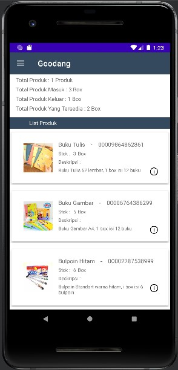

# 12 - RecyclerView

## Tujuan Pembelajaran

1. How to use the RecyclerView class to display items in a scrollable list.
2. How to dynamically add items to the RecyclerView as they become visible through scrolling.
3. How to perform an action when the user taps a specific item.
4. How to show a FAB and perform an action when the user taps it.

## Hasil Praktikum

Menambahkan dependencies Recyclerview

    dependencies {

        implementation 'androidx.appcompat:appcompat:1.2.0'
        implementation 'com.google.android.material:material:1.2.1'
        implementation 'androidx.constraintlayout:constraintlayout:2.0.2'
        implementation 'androidx.lifecycle:lifecycle-viewmodel:2.2.0'
        implementation "androidx.recyclerview:recyclerview:1.1.0"
    }

1. item_produk.xml
    
            <?xml version="1.0" encoding="utf-8"?>
            <LinearLayout xmlns:android="http://schemas.android.com/apk/res/android"
                xmlns:app="http://schemas.android.com/apk/res-auto"
                android:layout_height="wrap_content"
                android:layout_width="match_parent"
                android:layout_marginTop="10dp"
                android:orientation="horizontal">

                <androidx.cardview.widget.CardView
                    android:layout_width="0dp"
                    android:layout_height="wrap_content"
                    android:layout_weight="1"
                    android:layout_margin="5dp"
                    app:cardElevation="5dp">

                    <RelativeLayout
                        android:layout_width="match_parent"
                        android:layout_height="match_parent">

                        <ImageView
                            android:id="@+id/img_pro"
                            android:layout_width="75dp"
                            android:layout_height="75dp"
                            android:layout_centerVertical="true"
                            android:layout_marginLeft="30dp"
                            android:src="@drawable/cetak_buku_tulis_sekolah" />

                        <TextView
                            android:id="@+id/nama_produk"
                            android:layout_width="wrap_content"
                            android:layout_height="wrap_content"
                            android:layout_marginLeft="15dp"
                            android:layout_marginTop="20dp"
                            android:layout_toRightOf="@+id/img_pro"
                            android:text="nama produk"
                            android:textSize="15dp" />

                        <TextView
                            android:id="@+id/garis"
                            android:layout_width="wrap_content"
                            android:layout_height="wrap_content"
                            android:layout_marginLeft="15dp"
                            android:layout_marginTop="20dp"
                            android:layout_toRightOf="@+id/nama_produk"
                            android:text="-"
                            android:textSize="15dp" />

                        <TextView
                            android:id="@+id/kode_produk"
                            android:layout_width="wrap_content"
                            android:layout_height="wrap_content"
                            android:layout_marginLeft="15dp"
                            android:layout_marginTop="20dp"
                            android:layout_toRightOf="@+id/garis"
                            android:text="kode produk"
                            android:textSize="15dp" />

                        <TextView
                            android:id="@+id/stok"
                            android:layout_width="wrap_content"
                            android:layout_height="wrap_content"
                            android:layout_below="@+id/nama_produk"
                            android:layout_marginLeft="15dp"
                            android:layout_marginTop="5dp"
                            android:layout_toRightOf="@+id/img_pro"
                            android:text="Stok : "
                            android:textSize="12dp" />

                        <TextView
                            android:id="@+id/stok_produk"
                            android:layout_width="wrap_content"
                            android:layout_height="wrap_content"
                            android:layout_below="@+id/nama_produk"
                            android:layout_marginLeft="5dp"
                            android:layout_marginTop="5dp"
                            android:layout_toRightOf="@+id/stok"
                            android:text="jumlah stok"
                            android:textSize="12dp" />

                        <TextView
                            android:id="@+id/box"
                            android:layout_width="wrap_content"
                            android:layout_height="wrap_content"
                            android:layout_below="@+id/nama_produk"
                            android:layout_marginLeft="5dp"
                            android:layout_marginTop="5dp"
                            android:layout_toRightOf="@+id/stok_produk"
                            android:text="Box"
                            android:textSize="12dp" />

                        <TextView
                            android:id="@+id/deskripsi"
                            android:layout_width="wrap_content"
                            android:layout_height="wrap_content"
                            android:layout_below="@+id/stok_produk"
                            android:layout_marginLeft="15dp"
                            android:layout_marginTop="5dp"
                            android:layout_toRightOf="@+id/img_pro"
                            android:text="Deskripsi : "
                            android:textSize="12dp" />

                        <TextView
                            android:id="@+id/des_produk"
                            android:layout_width="225dp"
                            android:layout_height="wrap_content"
                            android:layout_below="@+id/deskripsi"
                            android:layout_marginLeft="15dp"
                            android:layout_marginTop="5dp"
                            android:layout_marginBottom="25dp"
                            android:layout_toRightOf="@+id/img_pro"
                            android:text="deskripsi barang"
                            android:textSize="12dp" />

                        <ImageView
                            android:id="@+id/detail_icon"
                            android:layout_width="20dp"
                            android:layout_height="20dp"
                            android:layout_marginLeft="10dp"
                            android:layout_marginTop="90dp"
                            android:layout_toRightOf="@+id/des_produk"
                            android:src="@drawable/information" />

                    </RelativeLayout>
                </androidx.cardview.widget.CardView>
            </LinearLayout>
2. fragment_produk.xml

            <?xml version="1.0" encoding="utf-8"?>
            <androidx.constraintlayout.widget.ConstraintLayout
                xmlns:android="http://schemas.android.com/apk/res/android"
                xmlns:app="http://schemas.android.com/apk/res-auto"
                android:layout_width="match_parent"
                android:layout_height="match_parent"
                android:layout_marginTop="?attr/actionBarSize">

                <LinearLayout
                    android:id="@+id/linier"
                    android:layout_width="0dp"
                    android:layout_height="100dp"
                    android:orientation="vertical"
                    app:layout_constraintEnd_toEndOf="parent"
                    app:layout_constraintHorizontal_bias="0.542"
                    app:layout_constraintStart_toStartOf="parent"
                    app:layout_constraintTop_toTopOf="parent">

                    <TextView
                        android:id="@+id/textView"
                        android:layout_width="152dp"
                        android:layout_height="wrap_content"
                        android:layout_marginStart="16dp"
                        android:layout_marginTop="5dp"
                        android:text="Total Produk : 1 Produk"
                        app:layout_constraintStart_toStartOf="parent"
                        app:layout_constraintTop_toBottomOf="@+id/linear" />

                    <TextView
                        android:id="@+id/textView2"
                        android:layout_width="wrap_content"
                        android:layout_height="wrap_content"
                        android:layout_marginStart="16dp"
                        android:layout_marginTop="5dp"
                        android:text="Total Produk Masuk : 3 Box"
                        app:layout_constraintStart_toStartOf="parent"
                        app:layout_constraintTop_toBottomOf="@+id/textView" />

                    <TextView
                        android:id="@+id/textView3"
                        android:layout_width="wrap_content"
                        android:layout_height="wrap_content"
                        android:layout_marginStart="16dp"
                        android:layout_marginTop="5dp"
                        android:text="Total Produk Keluar : 1 Box"
                        app:layout_constraintStart_toStartOf="parent"
                        app:layout_constraintTop_toBottomOf="@+id/textView2" />

                    <TextView
                        android:id="@+id/textView4"
                        android:layout_width="wrap_content"
                        android:layout_height="wrap_content"
                        android:layout_marginStart="16dp"
                        android:layout_marginTop="5dp"
                        android:text="Total Produk Yang Tersedia : 2 Box"
                        app:layout_constraintStart_toStartOf="parent"
                        app:layout_constraintTop_toBottomOf="@+id/textView3" />
                </LinearLayout>

                <LinearLayout
                    android:id="@+id/linier2"
                    android:layout_width="0dp"
                    android:layout_height="30dp"
                    android:layout_marginTop="10dp"
                    android:background="@color/splash_screen"
                    android:orientation="vertical"
                    app:layout_constraintEnd_toEndOf="parent"
                    app:layout_constraintHorizontal_bias="1.0"
                    app:layout_constraintStart_toStartOf="parent"
                    app:layout_constraintTop_toBottomOf="@+id/linier">

                    <TextView
                        android:id="@+id/textView5"
                        android:layout_width="wrap_content"
                        android:layout_height="wrap_content"
                        android:layout_marginLeft="50dp"
                        android:layout_marginTop="5dp"
                        android:text="List Produk"
                        android:textColor="@color/white"
                        android:textSize="14dp" />

                </LinearLayout>

                <androidx.recyclerview.widget.RecyclerView
                    android:id="@+id/pro_recyclerview"
                    android:layout_width="match_parent"
                    android:layout_height="match_parent"
                    android:layout_marginTop="135dp">

                </androidx.recyclerview.widget.RecyclerView>

            </androidx.constraintlayout.widget.ConstraintLayout>

3. RecyclerViewAdapterPro.java

        package com.example.goodang.produk;

        import android.content.Context;
        import android.view.LayoutInflater;
        import android.view.View;
        import android.view.ViewGroup;
        import android.widget.ImageView;
        import android.widget.TextView;

        import androidx.annotation.NonNull;
        import androidx.recyclerview.widget.RecyclerView;

        import com.example.goodang.R;

        import java.util.List;

        public class RecyclerViewAdapterPro extends RecyclerView.Adapter<RecyclerViewAdapterPro.MyHolder> {

            Context mContext;
            List<Produk> mData;

            public RecyclerViewAdapterPro(Context mContext, List<Produk> mData) {
                this.mContext = mContext;
                this.mData = mData;
            }

            @NonNull
            @Override
            public MyHolder onCreateViewHolder(@NonNull ViewGroup parent, int viewType) {
                View v;
                v = LayoutInflater.from(mContext).inflate(R.layout.item_produk, parent, false);
                RecyclerViewAdapterPro.MyHolder vHolder = new RecyclerViewAdapterPro.MyHolder(v);
                return vHolder;
            }

            @Override
            public void onBindViewHolder(@NonNull MyHolder holder, int position) {

                holder.nama.setText(mData.get(position).getNama());
                holder.kode.setText(mData.get(position).getKode());
                holder.deskripsi.setText(mData.get(position).getDeskripsi());
                holder.stok.setText(mData.get(position).getStok());
                holder.gambar.setImageResource(mData.get(position).getGambar());
            }

            @Override
            public int getItemCount() {

                return mData.size();

            }

            public static class MyHolder extends RecyclerView.ViewHolder{

                private TextView nama;
                private TextView kode;
                private TextView deskripsi;
                private TextView stok;
                private ImageView gambar;

                public MyHolder(@NonNull View itemView) {
                    super(itemView);

                    nama = (TextView)itemView.findViewById(R.id.nama_produk);
                    kode = (TextView)itemView.findViewById(R.id.kode_produk);
                    deskripsi = (TextView)itemView.findViewById(R.id.des_produk);
                    stok = (TextView)itemView.findViewById(R.id.stok_produk);
                    gambar = (ImageView) itemView.findViewById(R.id.img_pro);
                }
            }
        }

4. Hasil Ketika di Run

| Materi | Gambar 1 | Gambar 2 | Keterangan |
|--|--|--|--|
| RecyclerView |  |  | Data dimasukkan pada ProdukFragment.java |

