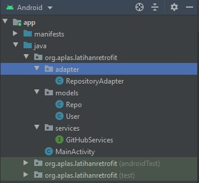
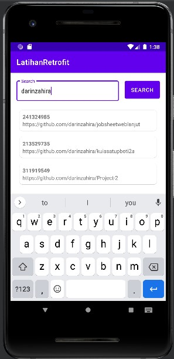

# 13 - Retrofit

## Tujuan Pembelajaran

1. Mahasiswa mampu mengonfigurasi Retrofit pada Android;
2. Mahasiswa mampu membuat request ke RESTful API menggunakan Retrofit.

## Hasil Praktikum

1. Silakan buat New Project di Android Studio dengan nama LatihanRetrofit.

2. Tambahkan izin koneksi internet di AndroidManifest.xml

=
< uses-permission android:name="android.permission.INTERNET" />

3. Tambahkan dependencies library Retrofit, converter-gson, dan compileOptions

=

implementation 'com.squareup.retrofit2:retrofit:2.9.0'

implementation 'com.squareup.retrofit2:converter-gson:2.9.0'

        compileOptions {
                sourceCompatibility = "8"
                targetCompatibility ="8"
            }

4. Buatlah package bernama services lalu buat class interface didalamnya

=

    public interface GitHubServices {
        @GET("users/{user}/repos")
        Call< List< Repo>> listRepos(@Path("user") String user);
    }

5. Buatlah package bernama models lalu buat class POJO didalamnya.

=

    public class Repo {
        @SerializedName("id")
        private Integer id;
        @SerializedName("html_url")
        private String htmlUrl;
        @SerializedName("description")
        private String description;
        public Integer getId() {
            return id;
        }
        public String getHtmlUrl() {
            return htmlUrl;
        }
        public String getDescription() {
            return description;
        }
    }

6. Pada class MainActivity, buat request ke REST API

=

public class MainActivity extends AppCompatActivity {

    @Override
    protected void onCreate(Bundle savedInstanceState) {
        super.onCreate(savedInstanceState);
        ActivityMainBinding binding = DataBindingUtil.setContentView(this, R.layout.activity_main);

        Retrofit retrofit = new Retrofit.Builder()
                .baseUrl("https://api.github.com/")
                .addConverterFactory(GsonConverterFactory.create())
                .build();

        GitHubServices services = retrofit.create(GitHubServices.class);

        Call<List<Repo>> repos = services.listRepos("darinzahira");

        repos.enqueue(new Callback<List<Repo>>() {
            @Override
            public void onResponse(Call<List<Repo>> call, Response<List<Repo>> repoList) {
                binding.setRepo(repoList.body().get(1));
            }

            @Override
            public void onFailure(Call<List<Repo>> call, Throwable t) {
                Log.e("Error", t.getMessage());
            }
        });
    }
}

7. Struktur packages dan class seharusnya seperti pada gambar berikut.

=

8. Silakan lakukan Run app. Apa yang terjadi? Jika masih ada error, silakan Anda
perbaiki.

=

## Tantangan

1. Tambahkan inputan dari user agar dapat mengganti username secara dinamis!

=

2. Tambahkan tampilan loading atau progress bar ketika sedang proses request ke REST API!

=

3. Berikan cara memberitahukan kepada user jika gagal request ke REST API selain menggunakan Toast!

=

